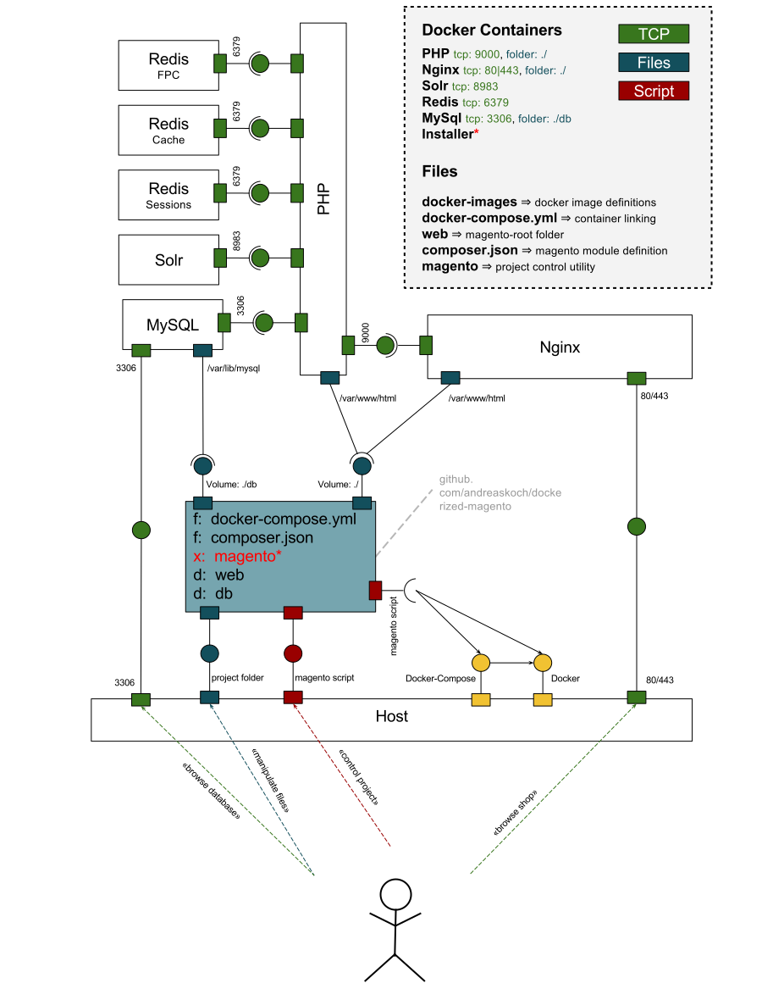

# Dockerized - Magento Community Edition 1.9.x

A dockerized version of "Magento Community Edition 1.9.x"

## Requirements

- [docker](http://docs.docker.com/compose/install/#install-docker)
- [docker-compose (formerly known as fig)](http://docs.docker.com/compose/install/#install-compose)

or

you can use [vagrant](https://www.vagrantup.com/) if you like.

## Usage

```bash
./magento <action>
```

**Actons**

- **start**: Starts the docker containers (and triggers the installation if magento is not yet installed)
- **stop**: Stops all docker containers
- **restart**: Restarts all docker containers and flushes the cache
- **status**: Prints the status of all docker containers
- **magerun**: Executes magerun in the magento root directory
- **composer**: Executes composer in the magento root directory
- **enter**: Enters the bash of a given container type (e.g. php, mysql, ...)
- **destroy**: Stops all containers and removes all data

**Note**: The `magento`-script is just a small wrapper arround `docker-compose`. You can just use [docker-compose](https://docs.docker.com/compose/) directly.

## Components

### Overview

The dockerized Magento project consists of the following components:

- **docker images**
  1. a [php 5.5](docker-images/php/Dockerfile) image
  2. a [nginx](docker-images/nginx/Dockerfile) web server image
  3. a [solr](docker-images/solr/Dockerfile) search server
  4. a standard [mysql](https://registry.hub.docker.com/_/mysql/) database server image
  5. multiple instances of the standard [redis](https://registry.hub.docker.com/_/redis/) docker image
  6. and an [installer](docker-images/installer/Dockerfile) image which contains all tools for installing the project from scratch using an [install script](docker-images/installer/bin/install.sh)
- a **shell script** for controlling the project: [`./magento <action>`](magento)
- a [composer-file](composer.json) for managing the **Magento modules**
- and the [docker-compose.yml](docker-compose.yml)-file which connects all components

The component-diagram should give you a general idea* how all components of the "dockerized Magento" project are connected:

[](documentation/dockerized-magento-component-diagram.svg)

`*` The diagram is just an attempt to visualize the dependencies between the different components. You can get the complete picture by studying the docker-compose file: [docker-compose.yml](docker-compose.yml)
