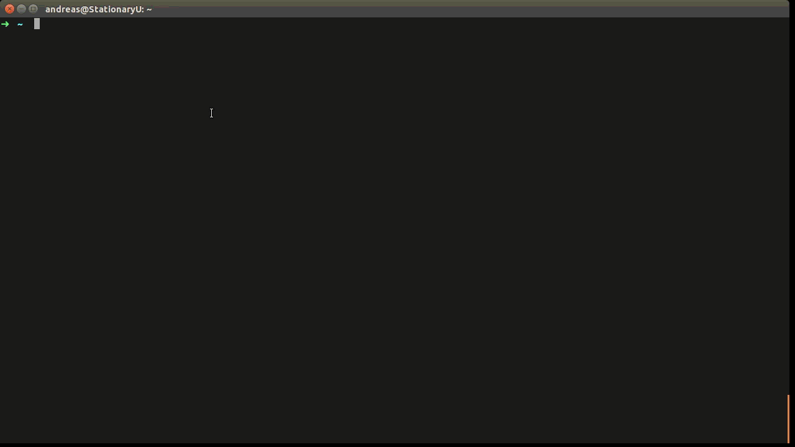

# Dockerized - Magento Community Edition 1.9.x

A dockerized version of "Magento Community Edition 1.9.x"

## Requirements

Before you start you should install

- [docker](http://docs.docker.com/compose/install/#install-docker) and
- [docker-compose (formerly known as fig)](http://docs.docker.com/compose/install/#install-compose)

or

You can use [vagrant](Vagrantfile) if you are on Windows or a Mac

## Installation

1. Make sure you have docker and docker
2. Clone the repository
3. Start the projects using `./magento start` or `docker-compose up`

```bash
git clone https://github.com/andreaskoch/dockerized-magento.git && cd dockerized-magento
./magento start
```

During the first start of the project **docker-compose** will

1. first **build** all docker-images referenced in the [docker-compose.yml](docker-compose.yml)
2. then **start** the containers
3. and **trigger the installer** which will
	- [install magento](docker-images/installer/bin/install.sh) and all modules that are referenced in the [composer.json](composer.json) using `composer` into the web folder
	- download the [Magento Demo Store Sample Data](http://www.magentocommerce.com/knowledge-base/entry/installing-the-sample-data-for-magento)
	- copy the files to the magento-root
	- import the sample database
	- and finally reindex all indices

Once the installation is fininished the installer will print the URL and the credentials for the backend to the installer log:

```
...
installer_1     | Frontend: http://127.0.0.1/
installer_1     | Backend: http://127.0.0.1/admin
installer_1     |  - Username: admin
installer_1     |  - Password: password123
```

[](https://s3.amazonaws.com/andreaskoch/dockerized-magento/installation/Dockerized-Magento-Installation-Linux-no-sound.mp4)

**Note**: The build process and the installation process will take a while if you start the project for the first time. After thats finished starting and stoping the project will be a matter of seconds.

## Usage

You can control the project using the built-in `magento`-script which is basically just a **wrapper for docker and docker-compose** that offers some **convenience features**:

```bash
./magento <action>
```

**Available Actons**

- **start**: Starts the docker containers (and triggers the installation if magento is not yet installed)
- **stop**: Stops all docker containers
- **restart**: Restarts all docker containers and flushes the cache
- **status**: Prints the status of all docker containers
- **magerun**: Executes magerun in the magento root directory
- **composer**: Executes composer in the magento root directory
- **enter**: Enters the bash of a given container type (e.g. php, mysql, ...)
- **destroy**: Stops all containers and removes all data

**Note**: The `magento`-script is just a small wrapper arround `docker-compose`. You can just use [docker-compose](https://docs.docker.com/compose/) directly.

## Components

### Overview

The dockerized Magento project consists of the following components:

- **[docker images](docker-images)**
  1. a [php 5.5](docker-images/php/5.5/Dockerfile) image
  2. a [nginx](docker-images/nginx/Dockerfile) web server image
  3. a [solr](docker-images/solr/Dockerfile) search server
  4. a standard [mysql](https://registry.hub.docker.com/_/mysql/) database server image
  5. multiple instances of the standard [redis](https://registry.hub.docker.com/_/redis/) docker image
  6. and an [installer](docker-images/installer/Dockerfile) image which contains all tools for installing the project from scratch using an [install script](docker-images/installer/bin/install.sh)
- a **[shell script](magento)** for controlling the project: [`./magento <action>`](magento)
- a [composer-file](composer.json) for managing the **Magento modules**
- and the [docker-compose.yml](docker-compose.yml)-file which connects all components

The component-diagram should give you a general idea* how all components of the "dockerized Magento" project are connected:

[](documentation/dockerized-magento-component-diagram.svg)

`*` The diagram is just an attempt to visualize the dependencies between the different components. You can get the complete picture by studying the docker-compose file:  [docker-compose.yml](docker-compose.yml)

Even though the setup might seem complex, the usage is thanks to docker really easy.

If you are interested in a **guide on how to dockerize a Magento** shop yourself you can have a look at a blog-post of mine: [Dockerizing  Magento](https://andykdocs.de/development/Docker/Dockerize-Magento) on [AndyK Docs](https://andykdocs.de)
